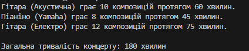

# Лабораторна робота №3v11 

## Тема : Наслідування: основи
## Мета : Закріпити знання про базові класи, похідні класи, модифікатори доступу, використання base, поліморфізм у простій формі.

### Опис проєкту
Проєкт “Музичні інструменти” демонструє використання принципів об’єктно-орієнтованого програмування у C#: успадкування, поліморфізм, конструктори з викликом базового конструктора та перевизначення методів.

### Основні функції:
* Створення об’єктів різних музичних інструментів.
* Виклик методу Play() для кожного інструмента, що відображає інформацію про гру.
* Обчислення та вивід загальної тривалості концерту.
* Демонстрація поліморфізму, коли один і той же метод викликається по-різному для різних об’єктів.

### Приклад запуску програми

