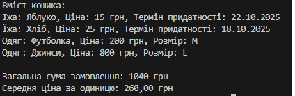

# Лабораторна робота №4v11 

## Тема : Абстракції та інтерфейси. Композиція та агрегація.
## Мета : навчитися створювати абстрактні класи та інтерфейси, будувати ієрархії класів із використанням композиції та агрегації, реалізовувати прості обчислення, демонструвати гнучкість і повторне використання коду.

### Опис проєкту
Проєкт “Кошик товарів” демонструє використання принципів об’єктно-орієнтованого програмування у C#: інтерфейси, абстрактні класи, успадкування та композицію.

### Основні функції:
* Створення продуктів різних типів
* Композиція (зв’язок між класами)
* Вивід інформації про кошик
* Обчислення фінансових показників
* Поліморфізм
* Гнучкість розширення

### Приклад запуску програми

